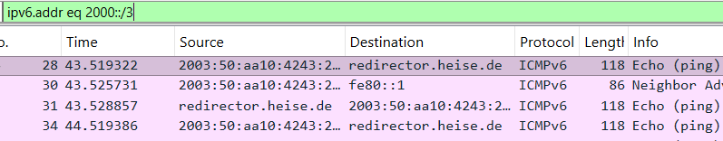

# IPv6 Findings

Keeping on with some CCNA findings, I thought of looking for the different kinds of IPv6 addresses. I will turn again toward  [Johannes Weber's Ultimate PCAP](https://weberblog.net/the-ultimate-pcap/) for this purpose.

_Remember_, an IPv6 address is 128 bits long.

## Introduction

- _File_: IPV6_Captures_UltimatePCAP.pcapng
- _Context_: Studying for the CCNA's IPv6 module

## Findings

## General IPv6

- _Filter_: `ipv6`
- _Packets_: 21118 (100%)
- _Protocols_:
	- The normal ones like TCP, UDP, DNS, Echo, RDP, among others.
	- Some rare ones like Discard Protocol, Daytime Protocol, Character Generator Protocol, among others.

### Global Unicast IPv6

- _Filter_: `ipv6.addr eq 2000::/3`
- _Packets_: 17238 (81.6%)
- _Description_: These are internally and externally routable IPv6 addresses.

	

### Multicast IPv6

- _Filter_: `ipv6.addr eq ff::/8`
- _Packets_: 39 (0.2%)
- _Description_:
	- The following list of "endpoints" reflect the **Solicited Node Multicast**, as seen with the prefixed `ff02::1:ff` addresses.
		- Judging by some of the source MAC addresses, the Solicited Node Multicast has the same last 6 hexadecimal as those seen in the MAC address. 

		![[ipv6_multicast.png|311]]
		- The majority of these are Neighbor Solicitations, which are the IPv6 version of ARP packets. The source is executing a **Duplicate Address Detection (DAD)** to see if another device that has the same **Link-Local Address** in the `fe80::/10` range, ending in the same last 6 hex values. I think another dedicated IPv6 post is due, so I can analyze anything about this protocol.

		

	- The `ff02::16` Multicast address, which is used from endpoints to L3 devices, to let them know if the source wants to be a part of a multicast group, who they want to listen to and who not to listen to. 
	- There are also a bunch of IPv6 muticast packets to nodes and routers, defined by `ff02::1` and `ff02::2`, respectively.

		

--------------------------------------------------------------------------

# CDP and LLDP Findings

I am currently re-studying the Cisco CCNA, and when learning about CDP and LLDP, a lightbulb lit up in my head... what would these two look in Wireshark? 

Since I had no way to simulate CDP and LLDP on the fly, I turned to [Johannes Weber's Ultimate PCAP](https://weberblog.net/the-ultimate-pcap/), and fortunately I found these traffic types, which I will analyze right now.

## Introduction

- _File_: The_Ultimate_PCAP.pcapng
- _Context_: Studying for the CCNA's CDP and LLDP.

## Cisco Discovery Protocol

- According to theory, CDP-talking devices advertise their information to other CDP-talking devices. This means CDP traffic provides information to the adjacent device.

- First thing I noticed, was the different stack in the packet:
	- **_Frame_**: The usual Frame information.
	- **_IEEE 802.3 Ethernet_**: Where the multicast destination MAC is found (_01:00:0c:cc:cc:cc_).
	- **_Logical-Link Control_**: Where, according to some investigation, is where Cisco managed to create its custom organization code (00:00:0c), and the CDP code (_0x2000_).
	- **_Cisco Discovery Protocol_**: Where the good stuff happens.

	

- In the CDP layer, I found several pieces of valuable information from the host advertising CDP. The following are things to note:
	- **Device ID_***: the device's name.
	- **_Software Version_**: the device's OS version.
	- **_Port ID_**: the device's interface, that sent the CDP. In this case, a FastEthernet0/1.
	- **_Platform_**: The device's product line (Cisco 3725)
	- **_Addresses_**: CDP also advertises IP addresses.
	- **_Capabilities_**: Can it be a router? A switch? A Host? Some of them? All of them?
	- **_Duplex_**: whether the device supports full / half duplex.

	

## Link-Layer Discovery Protocol

- The packet stack is different here, maybe because LLDP is a newer protocol than CDP:
	- **_Frame_**: The usual frame information.
	- **_Ethernet II_**: An Ethernet standard, a bit different from the IEEE 802.3. Here is where the multicast MAC address _01:80:c2:00:00:0e_ resides.
	- ***Link-Layer Discovery Protocol***: Where the good stuff happens.

- Some interesting I found in the LLDP-advertised information (the rest is similar from what was seen in the CDP use case):

	
	
	- **_Management Address_**: LLDP is able to send both the IPv4 and IPv6 addresses, if available.

		
		
	- **IEEE 802.3 - MAC/PHY Configuration/Status:** It has the different physical medium names with their supported duplex modes. If more than 1 is selected, it means the interface will be capable of supporting _auto-negotiation_.

		

	- **_IEEE 802.3 - Power Via MDI:_** This presents the supported PoE parameters.

		

	- **_End of LLDPDU_**: The end of the LLDP packet.

## Conclusions

- Both CDP and LLDP advertise a devices information. The information might be different.

- CDP and LLDP, in general, use different lower-level stacks for the physical medium.

- These traffic types don't require an acknowledgement or response. They just advertise.
