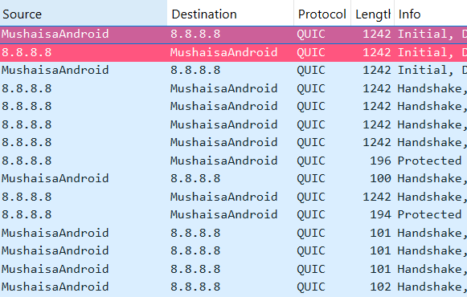
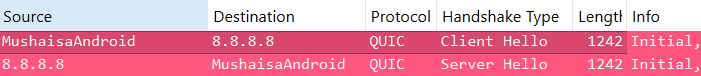
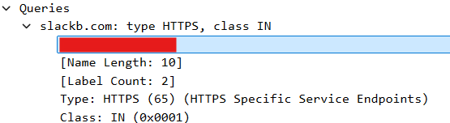
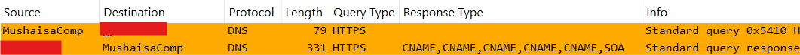
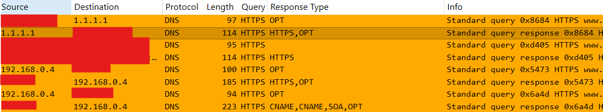
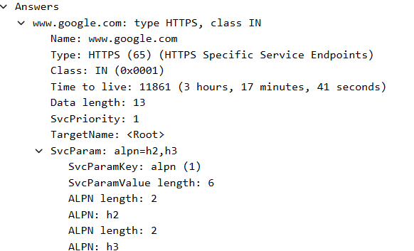
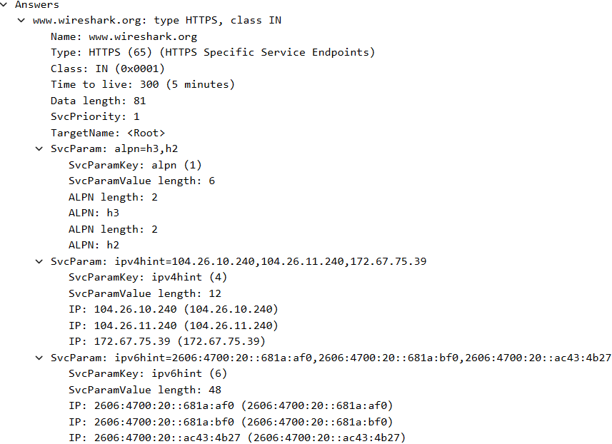
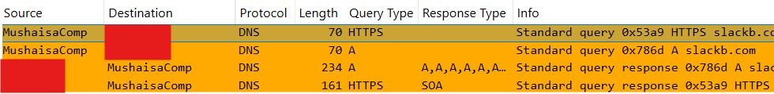

# DNS-over-HTTP3

## Introduction

I always wanted inspect packets from a "lonely" Android device, but for that I needed an device in the middle of the Android and the Internet. Fortunately, I got a hold of such a device and I immediately went to action.

The first thing the caught my eye was a possible DNS-over-HTTP3-over-QUIC UDP stream. The following are some of the technical specs from the capture:
- _File_: DoQ_Android.pcapng
- _Client_: MushaisaPhone
- _Destination_: 8.8.8.8
- _Background_:
	- The _Lonely Android_.

## QUIC Handshake

- When the destination IP is 8.8.8.8, and it is the QUIC protocol, it might have to do with DNS.

	

- A curious thing is, there is no _server name_ field in the negotiation parameters. This means the connection request was sent to the real 8.8.8.8 IP address, not to _dns.google_.

- The first 2 packets correspond to the _Client Hello_ and _Server Hello_, respectively (this might indicate some _0-RTT behavior_). This is a stark change from the TCP-based TLS negotiation, which usually takes a full 3-way handshake for the client to send its _Hello_.

	

- The handshake uses TLS1.3. Additionally, the packet lengths were 1242 bytes.

- The A-record being queried might be encrypted because it is nowhere to be seen.

-  Unfortunately, without any further SNI, A record domain, or any other field that might help us verify that this is indeed DN-over H3, the rest of the analysis pivots to just reading QUIC traffic.

## Conclusions

- When there is QUIC traffic to 8.8.8.8, it is most likely DNS-over-HTTP3.

- This traffic does not have an SNI.

- The A-record query might be encrypted.

# DNS-over-HTTP3

## Introduction

I always wanted inspect packets from a "lonely" Android device, but for that I needed an device in the middle of the Android and the Internet. Fortunately, I got a hold of such a device and I immediately went to action.

The first thing the caught my eye was a possible DNS-over-HTTP3-over-QUIC UDP stream. The following are some of the technical specs from the capture:
- _File_: DoQ_Android.pcapng
- _Client_: MushaisaPhone
- _Destination_: 8.8.8.8
- _Background_:
	- The _Lonely Android_.

## QUIC Handshake

- When the destination IP is 8.8.8.8, and it is the QUIC protocol, it might have to do with DNS.

	

- A curious thing is, there is no _server name_ field in the negotiation parameters. This means the connection request was sent to the real 8.8.8.8 IP address, not to _dns.google_.

- The first 2 packets correspond to the _Client Hello_ and _Server Hello_, respectively (this might indicate some _0-RTT behavior_). This is a stark change from the TCP-based TLS negotiation, which usually takes a full 3-way handshake for the client to send its _Hello_.

	

- The handshake uses TLS1.3. Additionally, the packet lengths were 1242 bytes.

- The A-record being queried might be encrypted because it is nowhere to be seen.

-  Unfortunately, without any further SNI, A record domain, or any other field that might help us verify that this is indeed DN-over H3, the rest of the analysis pivots to just reading QUIC traffic.

## Conclusions

- When there is QUIC traffic to 8.8.8.8, it is most likely DNS-over-HTTP3.

- This traffic does not have an SNI.

- The A-record query might be encrypted.

# DNS-over-HTTP3

## Introduction

I always wanted inspect packets from a "lonely" Android device, but for that I needed an device in the middle of the Android and the Internet. Fortunately, I got a hold of such a device and I immediately went to action.

The first thing the caught my eye was a possible DNS-over-HTTP3-over-QUIC UDP stream. The following are some of the technical specs from the capture:
- _File_: DoQ_Android.pcapng
- _Client_: MushaisaPhone
- _Destination_: 8.8.8.8
- _Background_:
	- The _Lonely Android_.

## QUIC Handshake

- When the destination IP is 8.8.8.8, and it is the QUIC protocol, it might have to do with DNS.

	

- A curious thing is, there is no _server name_ field in the negotiation parameters. This means the connection request was sent to the real 8.8.8.8 IP address, not to _dns.google_.

- The first 2 packets correspond to the _Client Hello_ and _Server Hello_, respectively (this might indicate some _0-RTT behavior_). This is a stark change from the TCP-based TLS negotiation, which usually takes a full 3-way handshake for the client to send its _Hello_.

	

- The handshake uses TLS1.3. Additionally, the packet lengths were 1242 bytes.

- The A-record being queried might be encrypted because it is nowhere to be seen.

-  Unfortunately, without any further SNI, A record domain, or any other field that might help us verify that this is indeed DN-over H3, the rest of the analysis pivots to just reading QUIC traffic.

## Conclusions

- When there is QUIC traffic to 8.8.8.8, it is most likely DNS-over-HTTP3.

- This traffic does not have an SNI.

- The A-record query might be encrypted.

--------------------------------------------------------------------------

# DNS HTTPS Record

## Introduction

When capturing traffic, my eye caught DNS traffic with an HTTPS record. Not knowing what it was about, I began to investigate a bit of what it was about.

Conceptually, the HTTPS record in DNS queries is defined in [RFC 9460](https://datatracker.ietf.org/doc/html/rfc9460#https), and it is also known as the _Record Type 65_. This record is used to increase the efficiency in which a client may connect to a server.

A successful answer to the HTTPS record query may contain some of the following:
- **HTTP/2** or **HTTP/3 (QUIC)** support,
- the delivery of the public key configuration needed to encrypt the Server Name Indication (SNI) for the use of TLS1.3.
- IPv4/IPv6 and TCP/UDP port hints, in order for the client to not perform additional NS lookups on other related domains.

The following are some of the technical specs from the captures:
- _File_: DNS_HTTPS_Record_2.pcang, Omar_AgentDisabled.pcapng
- _Client_: MushaisaComp.
- _Destination_: Local DNS Recursive Server.
- _Background_:
	- DNS_HTTPS_Record_2.pcapng captured traffic associated with `dig HTTPS <domain> @<server>`, where I replaced `<domain>` with the domain I wanted information from and `<server>` with 1.1.1.1.
	- Omar_AgentDisabled.pcapng is the base file that captured pure computer activity without any user interaction. Here is where the original HTTPS record queries were found.

## Original Capture

- The Wireshark filter used was the following: `(dns.flags.response==0 and not mdns and not llmnr) && (dns.qry.type == 65)`.

- DNS HTTPS record queries were sent to specific applications like Slack and Microsoft Teams.
	
	

- The query's information usually has something of this sort, which contains the domain and the record type.

	

- For the Slack case, DNS HTTPS record queries were sent involving all available Slack thread subdomains, and all answers came back with an SOA record. According to investigations, this means the server had no HTTPS record answers for those Slack subdomains.

	

- It was different when the computer sent DNS HTTPS record requests involving Microsoft Teams. The DNS resolver sent CNAMEs back, finalizing it with an SOA.

	

## DNS HTTPS Capture

- A separate capture was done for purposefully crafted DNS HTTPS record queries to several domains. As seen in the image below, some of the responses had valuable information, like the following:

	
	- the use of _HTTP/2 or HTTP/3_,

	

	- _CNAMEs_ (which just means the DNS recursive server was no able to find a response to the request, even when going through the domain's associated CNAMEs),

	- _IPv4/IPv6 hints_ on resolutions.

	

## DNS HTTPS Records in Context

- The DNS HTTPS record was not the only DNS traffic sent to the DNS recursive server when querying information about a domain. The client also sent an A record request, almost at the same time, from which a response is sent back.

	

## Conclusions

- The DNS protocol also has the HTTPS record, not just A and AAAA records.

- When querying the HTTPS record, different type of information is exchanged, for example, whether the domain supports HTTP/2 or HTTP/3, whether it supports SNI encryption, IPv4/IPv6 hints for possible domains resolutions.

- When a successful response is provided, the client will use that information to efficiently create a connection to the domain's server, using the selected HTTP version, hints and or encryption.

- The HTTP record query is not the only DNS traffic sent, since the A / AAAA record query is also sent almost at the same time. The client uses the information it gets from any query to establish the connection.
