# TCP Probes
(08/21/2026)

After going through a lesson about [TCP Conversation Completeness from expert packet analyst Chris Grier](https://www.youtube.com/watch?v=q7RdLva_244), I found this to be a good concept to use when looking for TCP Probes. I mean, those traffic streams that generally have no payload in them, and are only sent to find out if a host can have a conversation on a certain port.

Well, TCP Completeness is a Wireshark generated field that, among other use cases, can be used to find out if a packet capture has TCP probes in them.

The following analysis consists in presenting some TCP probes I caught, and I use TCP Completeness to find them.

## Introduction

- _Conditions_: Recently powered-up computer with no user interaction. It has the Netskope agent installed and enabled.

## TCP Completeness Overview

- As mentioned above, TCP Completeness is a Wireshark generated field. It presents which TCP flags were involved in a particular stream, and each TCP flag represents a binary number. Each binary number is a part of a full 6-bit number. The allocation is as follows:

| Flag      | RST | FIN | DATA | ACK | SYN+ACK | SYN |
| --------- | --- | --- | ---- | --- | ------- | --- |
| Bit Value | 32  | 16  | 8    | 4   | 2       | 1   |

## TCP Probe Search

- So, if some common TCP probes were to be searched, and knowing this type of traffic generally does not include payload data, the following Wireshark filters can be used:
	- **Full-Connect Probes**: these consist of 3-way handshake, followed by a _FIN_ and/or a _RST_.
		- `tcp.completeness in {23,39,55}`
	- **Half-Open Probes**: these involve a _SYN > SYN+ACK > RST_ sequence.
		- `tcp.completeness eq 35`
	- **ACK Probes**: these follow an _ACK > RST_ sequence, used to find some stateless firewalls.
		- `tcp.completeness eq 36`

- TCP Completeness is found inside the TCP layer, in the packet details. It is a **Wireshark generated field**, not properly a TCP field:

	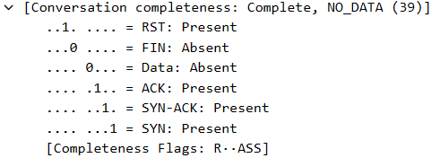

## TCP Probe Findings

- The first probe I found was the following, whose `tcp.completeness == 23`, representing a fully-connected TCP probe:

	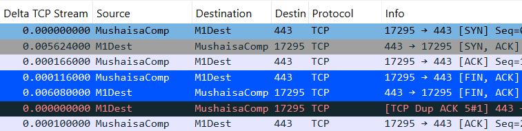

- The next probe (seen below) is a simple `SYN` packet, `tcp.completeness == 1`. Notice how the retransmission times increase exponentially (1, 2, 4, 8 seconds):

	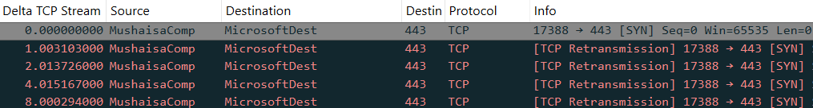

- Finally, a `tcp.completeness == 39`:

	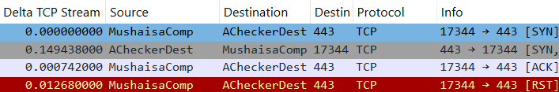

## Conclusions

- **TCP Completeness** is a Wireshark generated field.

- It determines if a TCP stream is deemed as _complete_, based on specific TCP flags and whether data was transferred.

- It is a useful field, when searching for TCP probes. 

__________________________________________________________________________

# Google CA Server Traffic

## Introduction

This is an example of the test computer reaching out to a Google Cloud for the Certificate Authority Service. The computer ends up downloading a certificate and a Certificate Revocation List. 

- _File_: Privateca_NetskopeBWAN.pcapng
- _Conditions_: Recently powered-up computer with no user interaction. It has the Netskope agent installed and enabled.

## 3-Way Handshake

- **Client Side** (Mushaisa Comp):

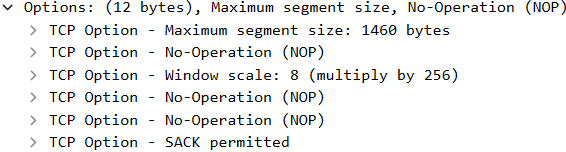

- **Server Side** (Google CA Server):

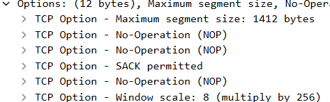

## Initial Stats

- _Packets_: 280
- _Destination Port_: 80 (HTTP)
- _Total Time_: 91.3 seconds
- _TCP Conversation Completeness_: 31 (with data)
- _Bad TCP Packets_: 4/280.
	- _DUP ACKs_: 1
	- _TCP KeepAlives_: 3

## Analysis

-  The client sends an HTTP GET request to the Google CA Sever asking for a CA certificate.

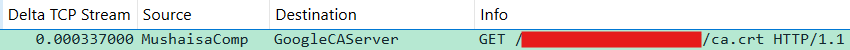

- Two server-side MSSs and 52 bytes later, the client was able to download the CA certificate.

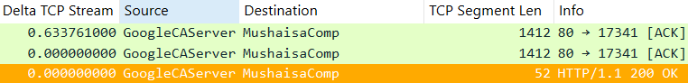

- Then, the client sends an HTTP GET request to the Google CA Server asking for the Certificate Revocation List.

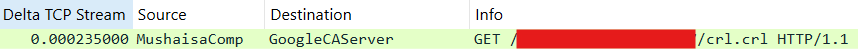

- 0.5 seconds and a little under 200 almost-fullsize-server-side-MSSs later, the server manages to send the Certificate Revocation List.

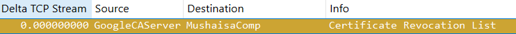

- Finally, some keep-alives are exchanged and the stream ends with graceful TCP FIN+ACKs.

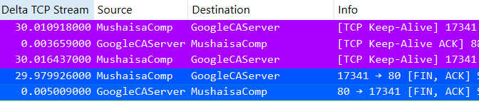
