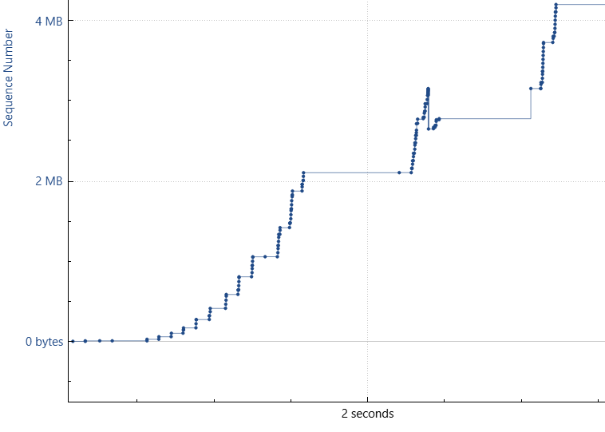
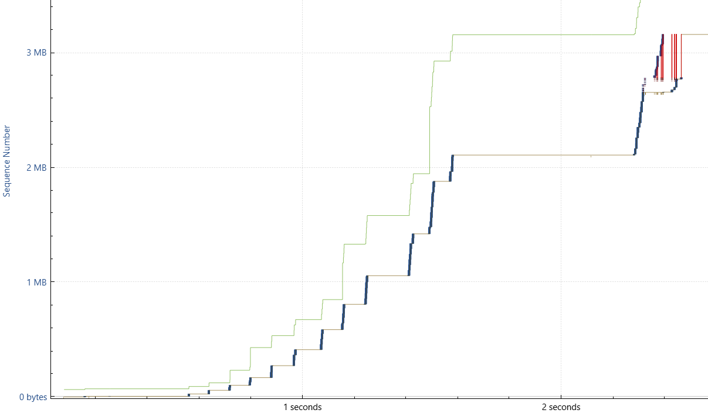
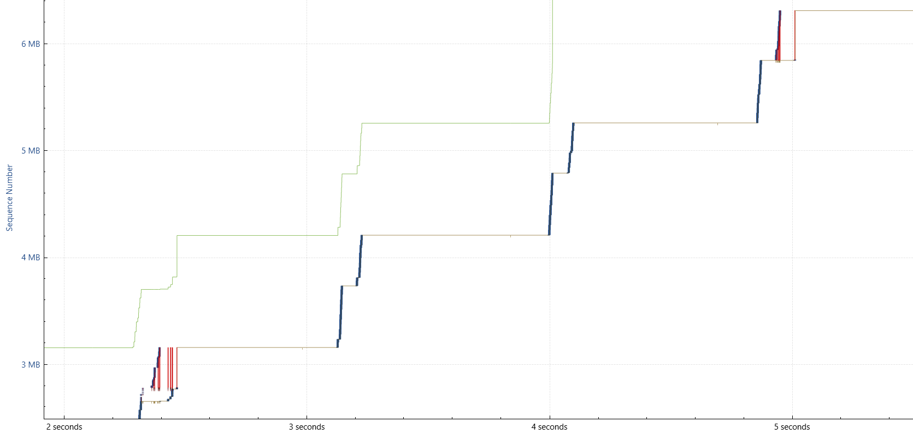
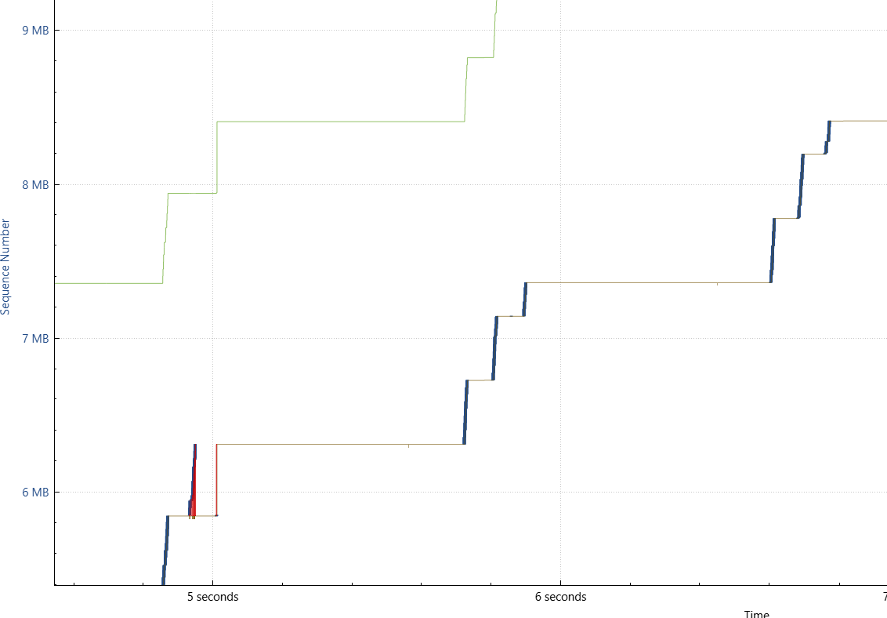
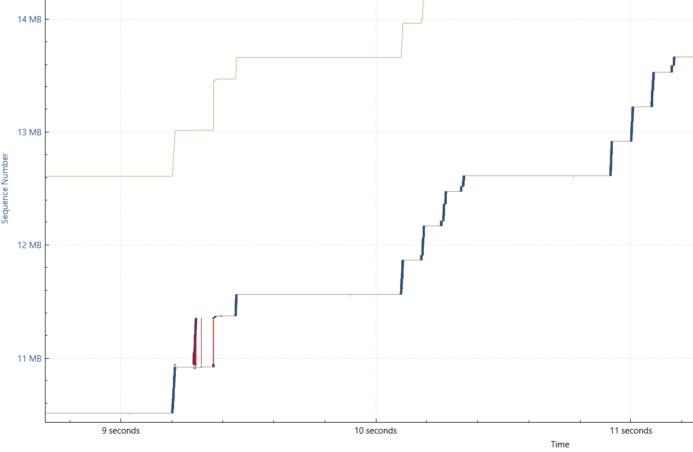
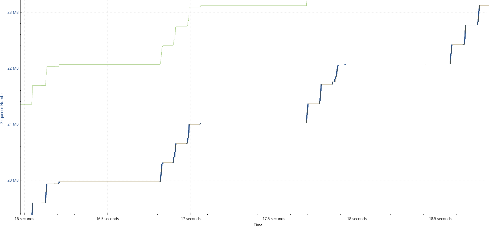
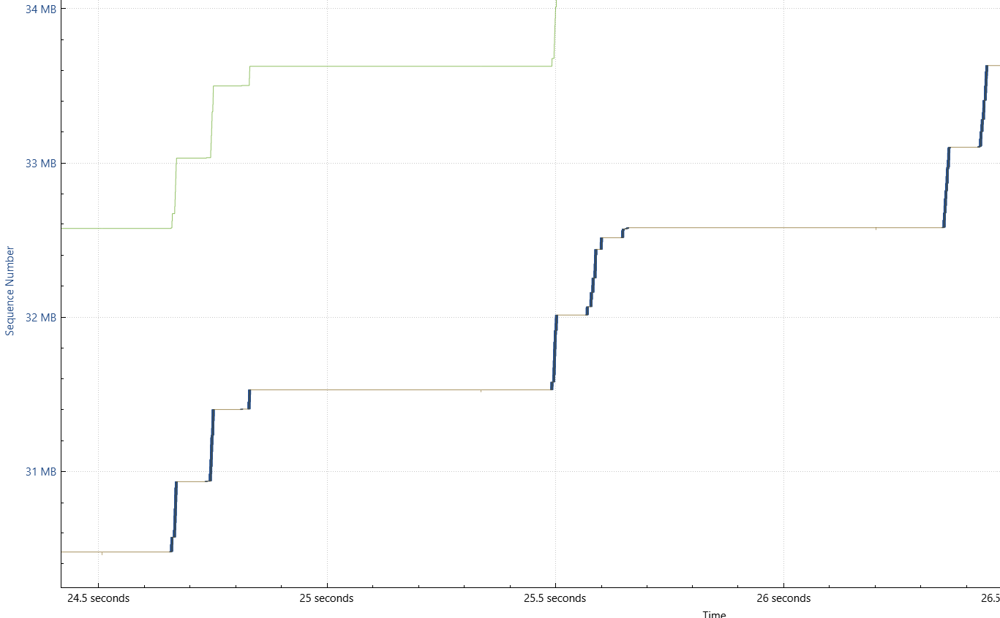

# Congestion Window Sighting 2

This stream also follows a _Congestion Window_ pattern when a computer is downloading a particular certificate from the Internet.

- **Slow Start**: As seen in the following graph, the "wait time" between traffic bursts gets shorter and shorter as time goes on, except for the wait time around the 1 second mark, which, according to the packet capture, was just a delay in the certificate server's response.

![[cwnd_images/cert_slowstart.png]]

- From the _Slow Start_, traffic continues its steep climb when transferring information, taking less time between traffic bursts from the server side:

![[cwnd_images/certsteep_cwnd_1.png]]

- The climb gets steeper (the time between traffic bursts is reduced), until the exchange stops:

![[cwnd_images/certsteep_cwnd_2.png]]

**Conclusions**:
	- The initial exponential slow-start appears.
	- The sender tries sending data in single bursts, increasing those bursts every RTT.
	- As opposed to the earlier congestion window sighting, there are no SACK blocks, thus the transfer bursts get steeper and steeper until it ends.
# Congestion Window Sighting

- **Congestion Window** sighting in the Stevens graph on one of a particular IP's TCP streams, with both its slow-start.
- In particular for the slow-start, the Sequence Numbers increase in single bulks of data, which will change after the first sighting of a Selective ACK.

- Around the 2.25 second mark, as seen in the Stevens graph, some Selective Acks are seen. This can be verified when analyzing the TCPTrace graph for the same stream. After that, the Sequence Numbers increase in a two-step fashion.

- After the SACKs, the 20.42.1.1's Sequence Numbers do not increase exponentially, rather, 20.42.1.1 sends a steady stream of data, that when zoomed out, it looks like it has a linear behavior.

- Thereafter, the linear increase of the Sequence Numbers changes its behavior. Before the 5-second-mark SACK, the increments were a two-step process, however, after the SACK the increments became a 3-step-process.

- What is even more impressive is that later on, around the 9.5 second mark, another SACK is seen, that may have cause the Sequence Number increments to become a 4-step process. 
- It is worth noting that these steps have smaller Sequence Number increments, as opposed to when before the first SACK instance. Having more "steps" in the data transfer makes transfers a bit slower, as opposed to having a single or 2-step bursts.

- Going further in the TCPTrace and Stevens graphs, it seems the steps get reduced from 4, to 3, to 2. This means the sender is trying to speed-up the data transfer, hopefully trying to bring it down to just a single burst per RTT.

- **Conclusions**:
	- The initial exponential slow-start appears.
	- The sender tries sending data in single bursts, increasing those bursts every RTT.
	- After every SACK block, the sender segments the data transfer into smaller bursts of traffic. These segments start with 2, the 3 after another SACK block, then 4 segments after the final SACK block seen.
	- Given no other SACK block appears, the sender tries decreasing the segments to a single burst of data.
