# Full TCP Analysis I
(08/06/2026)

## Introduction

- _Packets_: 51687
- _Client IP_: 192.0.2.106 (MushaisaComp)
- _Server IP_: 240.171.90.153(RemoteServer)
- _Server Domain_: 1d.tlu.dl.delivery.mp.microsoft.com
- _Capture_: Client-side

## 3-Way Handshake

The 3-way handshake was captured and it had the following TCP Options:
- **Client Side**:
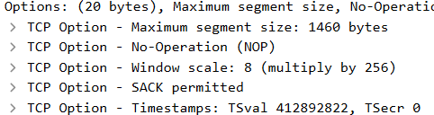

- **Server Side**:
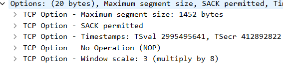

 - **Observations**:
	 - The server will be able to send 8-bytes less than that what the client can send.
	 - The Windows Scale is lower on the server's side than on the client's side.
	 - **TCP Timestamps**: This TCP connection is benchmarking round-trip time measurements.

## Data Flow

This stream's data flow consists of a simple HTTP GET request to a Microsoft CDN Microsoft updates, patches and files.

## TCP Errors and Alerts

- Using the `tcp.analysis.flags` display filter, the following TCP flags were found. Some findings about these TCP fags will explained.

| TCP Flags               | Packets |
| ----------------------- | ------- |
| Window Full             | 16      |
| ZeroWindow              | 10      |
| Dup ACK                 | 147     |
| Retransmissions         | 15      |
| Prev. Seg. not Captured | 3       |
| Window Update           | 39      |
| Out-of-Order            | 33      |

- **Window Full**:
	- From the start of the TCP stream, despite the client advertising a window of 65535 bytes (with possibly increasing it 256 times more), the HTTP GET's packet advertises just a Calculated Window Size of 2816 bytes.
	- The server then sends `1408 + 1408 bytes = 2816 bytes` worth bytes of data (not even the server's own MSS), effectively triggering a Wireshark `TCP Windows Full` alert.
	- By the time the client sends an ACK back, its Window Size increases to 3072 bytes.
	- The server more data given there is more space on the client-side: `1440 + 1440 + 192 bytes = 3072 bytes`, which triggers another `TCP Window Full` alert.
	- This goes on and on: the client sends an ACK back with its available Window Size, which increases as time goes on, and the server sends as much data as it can, thus triggering the `TCP Window Full` alert again and again. Eventually, the time between those alerts increases, which reveals more traffic stability.

	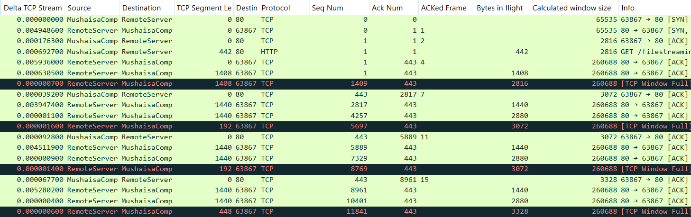

	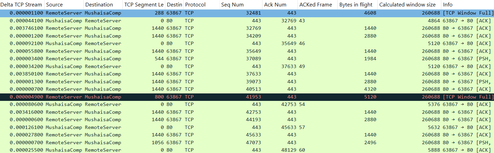

- **ZeroWindow**:
	- Sent by the client.
	- Usually, `ZeroWindow` packets are followed by Window Update packets, to refresh the client's receive window.
	- According to the Windows Scaling Graph, the client's calculated receive window drops to zero on several occasions, leaving no room to receive any traffic from the server.
	- There is a slight difference between a _ZeroWindow_ and a _TCP Window Full_:
		- _ZeroWindow_: the client is actually advertising to the server that the advertised receive window is full.
		- _TCP Window Full_: Wireshark calculates the following formula `Last Advertised Window = Cumulated Bytes in Flight`. The server then awaits the client's ACK to know what the real advertised window should from then on.
	- The following Windows Scale graph illustrates how the client's advertised window scale increases at certain points, and then decreases in several other instances. Close to the 7.5 second mark is when the client's window size spikes down to zero several times.

	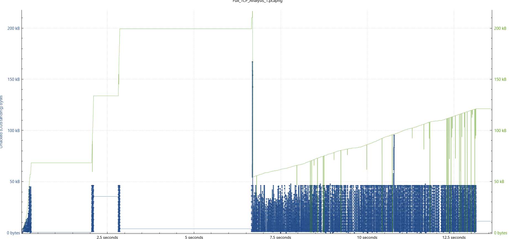

- **Previous Segment Not Captured / Out-of-Order / Retransmissions**:
	- There is an eerie relationship between all three of them.
	- It all starts with a `Previous Segment No Captured` on packet 2559, whose sequence # is 38 full MSS's from the last received sequence #. Thereafter, the server keeps sending packets from that sequence # onward. However, these packets are not tagged as `Previous Segment No Captured` nor `Out-of-Order`.
	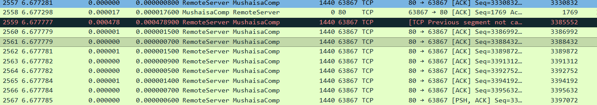

	- This is proven when the client sends a series of `TCP DUP Ack`s thereafter. The SACK blocks start acknowledging the sequence #'s from packets 2559 - 2567.
	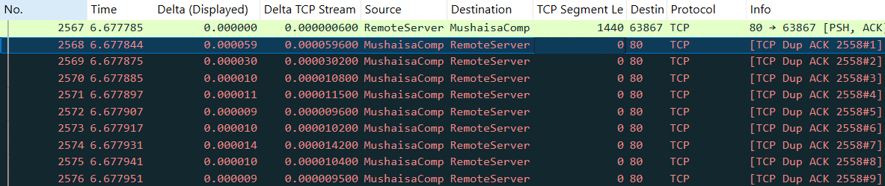

	- This means packet analysts should be aware of how `Previous Segment No Captured` packets are read, and how the subsequent packets are captured, in context.
	- Sort of the same symptom happens when a `Retransmission` happens. Packet 2691 starts the `Fast Retransmission` process, after which subsequent successfully captured retransmissions are tagged as such. 
	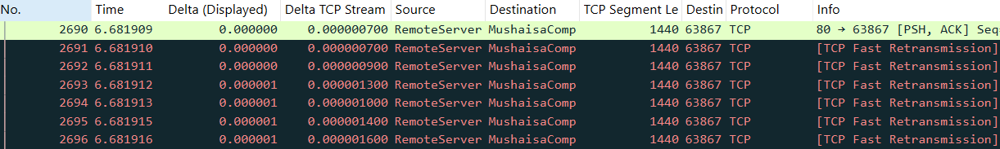

	- However, the next retransmission series is tagged as `Out-of-Order` packets. To prove the latter is part of the same retransmission segments as the fast-retransmissions seen earlier, the `Out-of-Order` SACK blocks indicate they are the rightful continuation of them.
	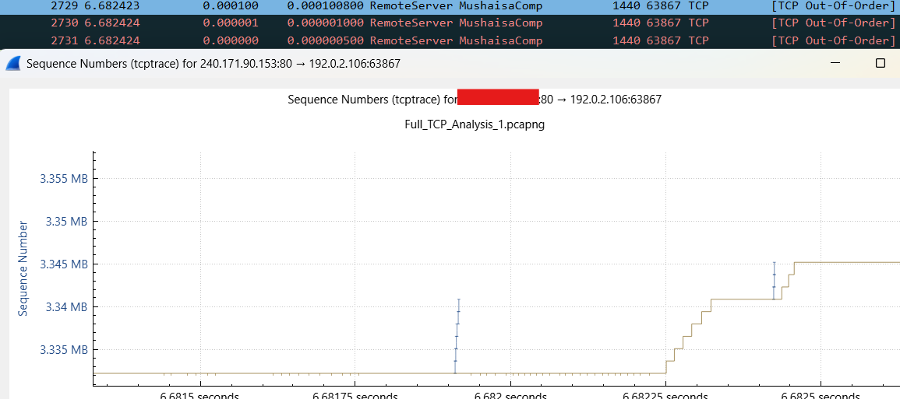

	- There are other examples of this throughout this trace file. So this is another warning to packet analysts: **always follow SACK block numbers** when analyzing packet loss. Some server retransmissions may be deemed as `Out-of-Order` packets.

__________________________________________________________________________

# Congestion Window Sighting 2

This stream also follows a _Congestion Window_ pattern when a computer is downloading a particular certificate from the Internet.

- **Slow Start**: As seen in the following graph, the "wait time" between traffic bursts gets shorter and shorter as time goes on, except for the wait time around the 1 second mark, which, according to the packet capture, was just a delay in the certificate server's response.

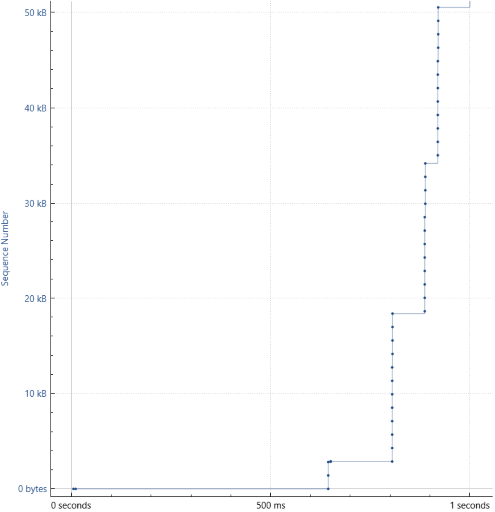

- From the _Slow Start_, traffic continues its steep climb when transferring information, taking less time between traffic bursts from the server side:

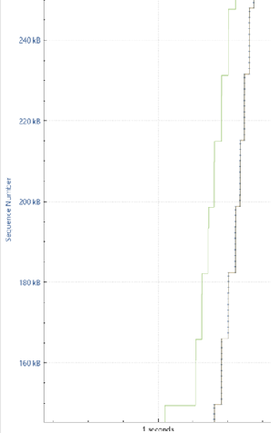

- The climb gets steeper (the time between traffic bursts is reduced), until the exchange stops:

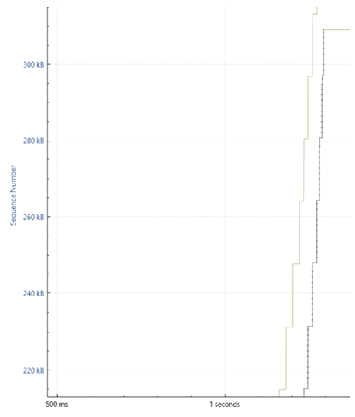

- **Conclusions**:
	- The initial exponential slow-start appears.
	- The sender tries sending data in single bursts, increasing those bursts every RTT.
	- As opposed to the earlier congestion window sighting, there are no SACK blocks, thus the transfer bursts get steeper and steeper until it ends.

__________________________________________________________________________

# Congestion Window Sighting

- **Congestion Window** sighting in the Stevens graph on one of a particular IP's TCP streams, with both its slow-start.
- In particular for the slow-start, the Sequence Numbers increase in single bulks of data, which will change after the first sighting of a Selective ACK.

- Around the 2.25 second mark, as seen in the Stevens graph, some Selective Acks are seen. This can be verified when analyzing the TCPTrace graph for the same stream. After that, the Sequence Numbers increase in a two-step fashion.

- After the SACKs, the 20.42.1.1's Sequence Numbers do not increase exponentially, rather, 20.42.1.1 sends a steady stream of data, that when zoomed out, it looks like it has a linear behavior.

- Thereafter, the linear increase of the Sequence Numbers changes its behavior. Before the 5-second-mark SACK, the increments were a two-step process, however, after the SACK the increments became a 3-step-process.

- What is even more impressive is that later on, around the 9.5 second mark, another SACK is seen, that may have cause the Sequence Number increments to become a 4-step process. 
- It is worth noting that these steps have smaller Sequence Number increments, as opposed to when before the first SACK instance. Having more "steps" in the data transfer makes transfers a bit slower, as opposed to having a single or 2-step bursts.

- Going further in the TCPTrace and Stevens graphs, it seems the steps get reduced from 4, to 3, to 2. This means the sender is trying to speed-up the data transfer, hopefully trying to bring it down to just a single burst per RTT.

- **Conclusions**:
	- The initial exponential slow-start appears.
	- The sender tries sending data in single bursts, increasing those bursts every RTT.
	- After every SACK block, the sender segments the data transfer into smaller bursts of traffic. These segments start with 2, the 3 after another SACK block, then 4 segments after the final SACK block seen.
	- Given no other SACK block appears, the sender tries decreasing the segments to a single burst of data.
